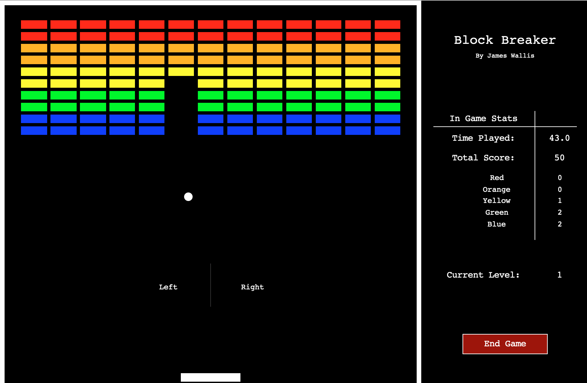

# blockbreaker
## University first year Python competition



## Running
Written for Python 2.7.
Uses the `graphics.py` module written by John Zelle.

```
python blockbreaker.py
```

## Python Programming Competition
*Copied from the original competition pdf*

### Task:
Improve and extend either the Squash or the Android-Apple game developed in the
lectures on 11th and 18th November – the files are on Moodle.

### Brief Rules: 
This is an individual competition – group entries are not allowed. Use only Python and the graphics module. Don't write (object-oriented) classes and do not use non- standard libraries such as PyGame – any modules you use apart from graphics.py must be part of the standard Python 3 distribution. However, if you want to add sound, I suggest using the winsound module (this only works on Windows, but you can assume that we will use a Windows computer to run your program). Do not re-write the game completely – it should still involve bat(s)/ball or an android eating apples (but of course, it could do other things as well!). Keep to the spirit of the unit and the competition, and make sure that your game would not offend anyone.

